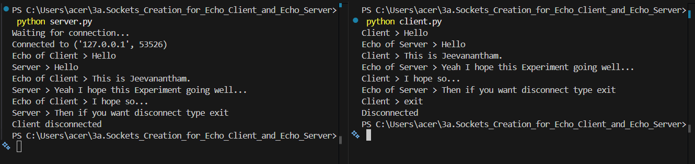

# 3a.CREATION FOR ECHO CLIENT AND ECHO SERVER USING TCP SOCKETS
# AIM
To write a python program for creating Echo Client and Echo Server using TCP
Sockets Links.
## ALGORITHM:
1. Start the program and include required libraries.
Import the necessary socket and input/output libraries required for network communication.
These libraries help in creating sockets and handling data transfer between client and server.

2. Create a socket for communication.
The server creates a TCP socket using the socket() function.
This socket will be used to establish a reliable connection between the client and the server.

3. Bind the socket with IP address and port number.
The server assigns an IP address and port number using the bind() function.
This allows the server to identify itself on the network for incoming client requests.

4. Put the server in listening mode.
The server waits for connection requests from clients using the listen() function.
It keeps monitoring the specified port for any incoming connection attempts.

5. Accept the client connection.
When a client sends a request, the server accepts it using the accept() function.
After acceptance, a new socket is created for communication with that client.

6. Client creates a socket and connects to the server.
The client program creates its own TCP socket using socket().
Then it connects to the server using the connect() function with the server IP and port.

7. Send and receive messages between client and server.
The client sends a message to the server using send() or write() function.
The server receives the message and sends the same message back to the client (echo).

8. Close the connection and terminate the program.
After the communication is completed, both client and server close their sockets.
This releases the resources and ends the TCP connection properly.
## PROGRAM
server:
```
import socket
s=socket.socket()
s.bind(('localhost', 8001))
s.listen(1)
print("Waiting for connection...")
c, addr=s.accept()
print("Connected to", addr)
while True:
    clientMessage=c.recv(1024).decode()
    if clientMessage=="exit":
        print("Client disconnected")
        break
    print("Echo of Client >", clientMessage)
    reply = input("Server > ")
    c.send(reply.encode())
c.close()
s.close()
```
client:
```
 import socket
s=socket.socket()
s.connect(('localhost', 8001))
while True:
    msg=input("Client > ")
    s.send(msg.encode())
    if msg=="exit":
        print("Disconnected")
        break
    print("Echo of Server >", s.recv(1024).decode())
s.close()
```
## OUPUT

## RESULT
Thus, the python program for creating Echo Client and Echo Server using TCP Sockets Links 
was successfully created and executed.
